_Image by Nigel_

# Smart Spectral Sensing Workshop

Hacking the LilyGo Wristband

## Download the files from github

Go to this repository and download it as a .zip file so you have everything
https://github.com/Xinyuan-LilyGO/LilyGo-T-Wristband

## Board version

We are working with the LSM9DS1 accelerometer chip and are following this version of the tutorial.

https://github.com/Xinyuan-LilyGO/LilyGo-T-Wristband/blob/master/examples/T-Wristband-LSM9DS1/README.MD

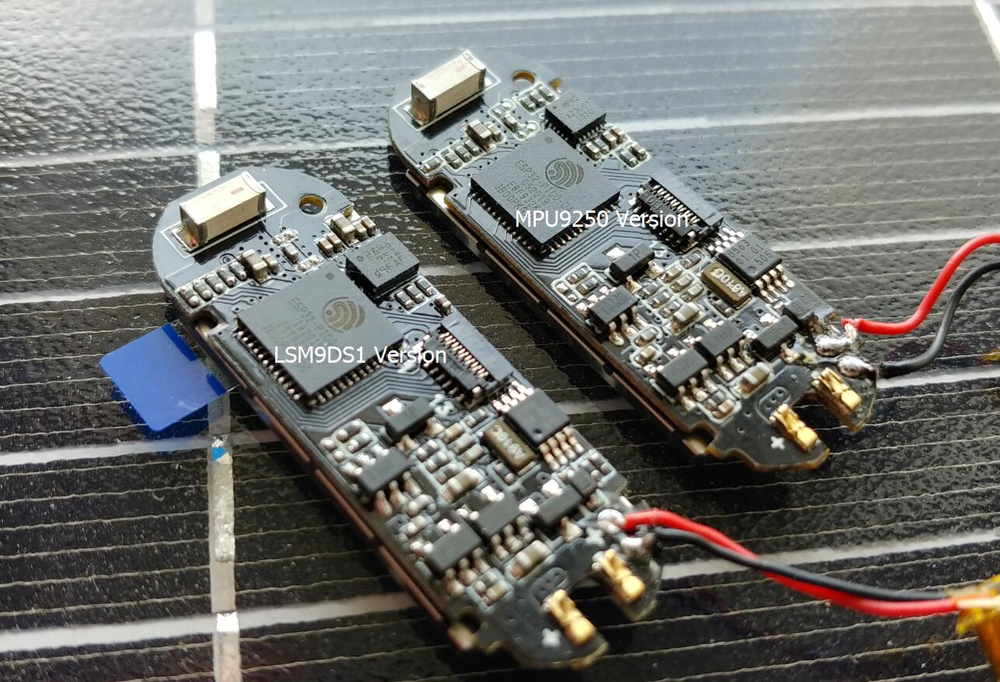 _Note the difference to confirm which version you are using_

## Drivers

The programmer board _probably_ uses the CH340 USB to Serial chip, if you don't have the driver for this chip you need to install them. If it doesn't work, try installing the CP21xx driver as well.

[CH340 Drivers](http://www.wch-ic.com/search?q=ch340&t=downloads)
[CP21xx Drivers](https://www.silabs.com/products/development-tools/software/usb-to-uart-bridge-vcp-drivers)

### MacOS

**The CH340 driver**

Open terminal and navigate to:

    cd /Library/Extensions

Then list the usb drivers

    ls | grep usb

If you see _usb.kext_ or _usbserial.kext_ it means you have TCH340 driver files installed. If not: go through this tutorial to install (uninstalling is also described here):

https://learn.sparkfun.com/tutorials/how-to-install-ch340-drivers/all#mac-osx

**The CP21 driver**

if you have it, something like this would exist in your machine:

> Macintosh HD/Library/Extensions/SiLabsUSBDriver.kext

### Windows

On Windows 10 the driver should install automatically, otherwise follow the instructions here:
https://github.com/Xinyuan-LilyGO/LilyGo-T-Wristband/blob/master/examples/T-Wristband-MPU9250/README.MD

### Install board files for ESP32 (if necessary)

Check if you find _ESP32 Dev Module_ under

> Tools > Boards.

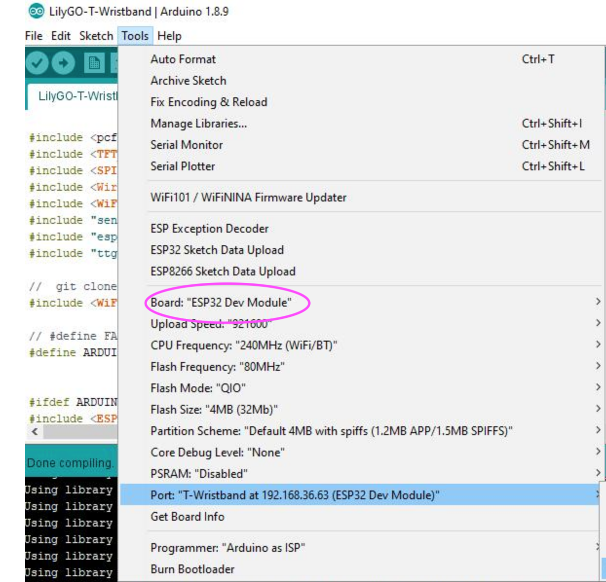

If not: add this url to your Additional Board Manager URLS. To do that, in the Arduino IDE go to:

> File > Preferences

And paste the following link into the box that says "Additional Board Manager URLs:
https://dl.espressif.com/dl/package_esp32_index.json

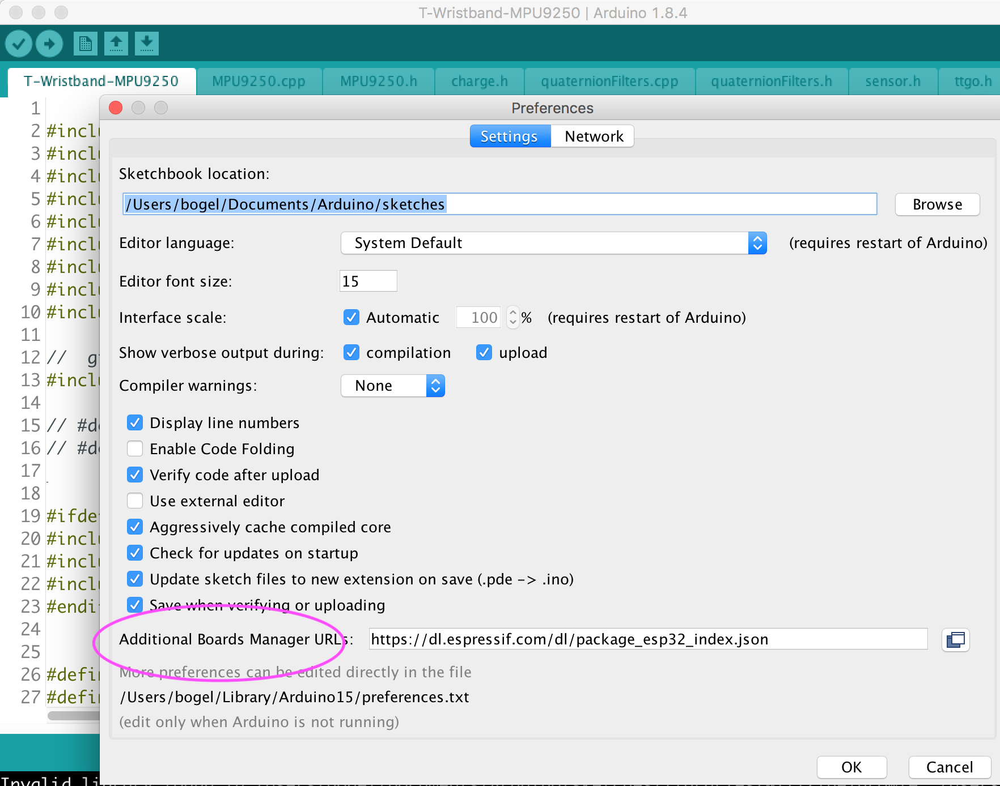

Then go to

> Tools > Board > Boards Manager ...

and search for _ESP32_. A library by Espressif systems should show up and allow you to install or update.

Restart Arduino and check if you can find the board now

## Install the libraries dependencies

Find the folder called _libdeps_ in the LilyGo wristband repository, and copy paste its contents to your Arduino Library folder. Mine is in:

    Macintosh HD > Users > [username] > Documents > Arduino > sketches > libraries

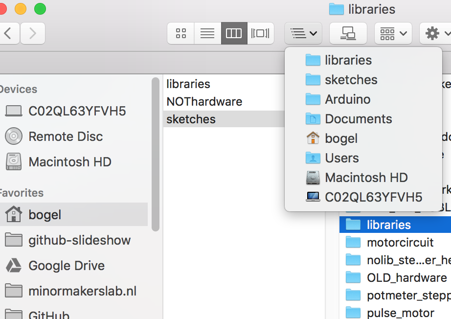_Path to arduino libraries_

- **pcf8563.h** controls the clock chip
- **SparkFun_LSM9DS1_Arduino_Library** to control the sensor
- **TFT_eSPI** library to put the graphics on the display (using SPI communication protocol)
- **WiFiManager** allows you connect the ESP module to the wifi in a graphical interface

If you are not sure where to find these, alternatively you can compress each library folder into its own .zip file.

> Sketch > Include Library > Add .ZIP library

and then going into the library manager via

> Sketch > Include Library > Library manager

Where you search for the library and click to install it.

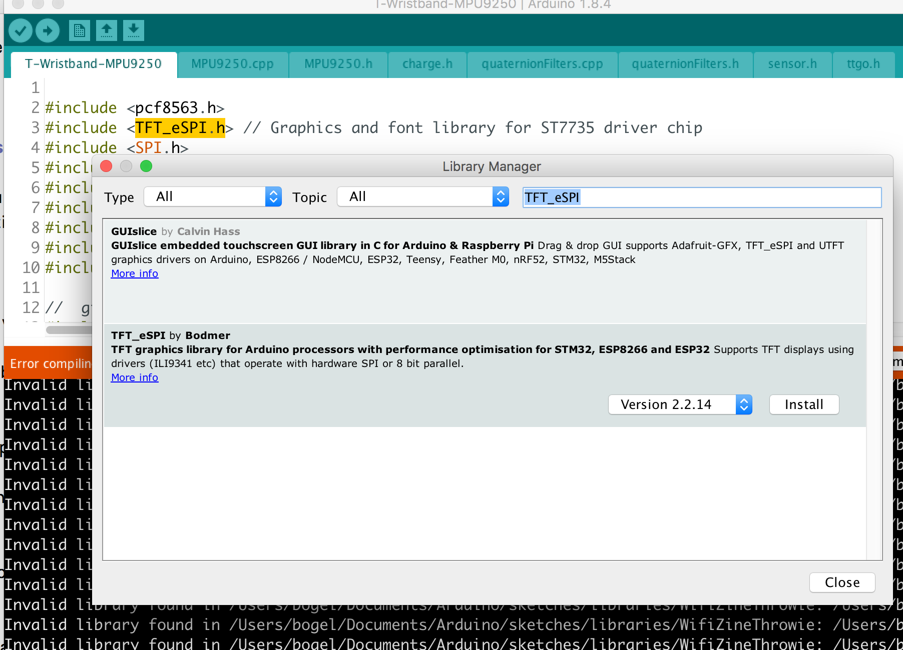 _Installing a library with the library manager_

### User Definitions for the TFT_eSPI lib

_You only need to do this if you installed the TFT_eSPI library through the Library Manager, if you copied it as above this step us unnecessary!_

Open the file called _User_Setup_Select.h_ that is inside the TFT_eSPI library.

Locate line 20 that says:

    // Only ONE line below should be uncommented.  Add extra lines and files as needed.

Make sure all the lines starting with **#include** are commented out, except this one:

    #include <User_Setups/Setup26_TTGO_T_Wristband.h>  // Setup file for ESP32 and TTGO T-Wristband ST7735 SPI bus TFT

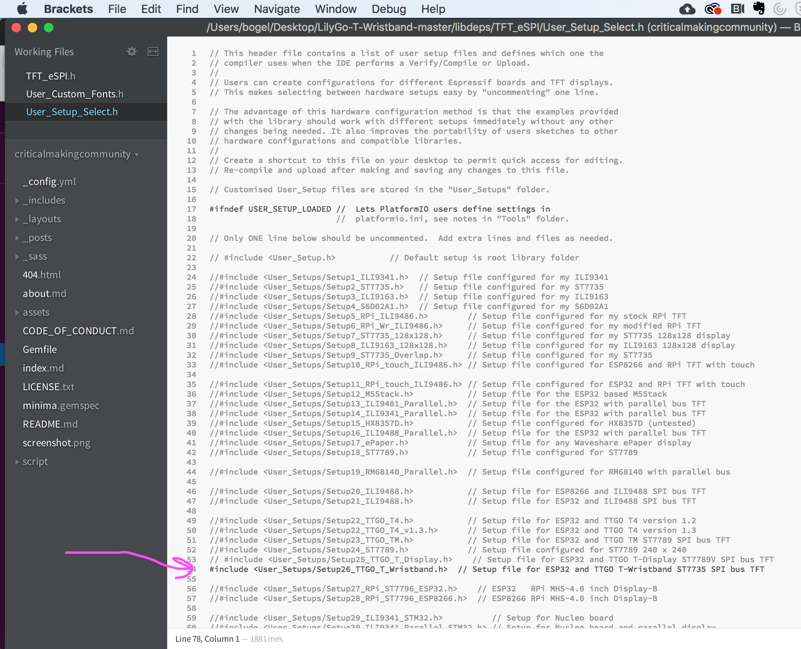 _The file should look like this as a result_

Save the file and close.

## Programming the board

Take the device out of the bracelet and open it up: with the screen facing up, open it on the right side, where the touch button is.

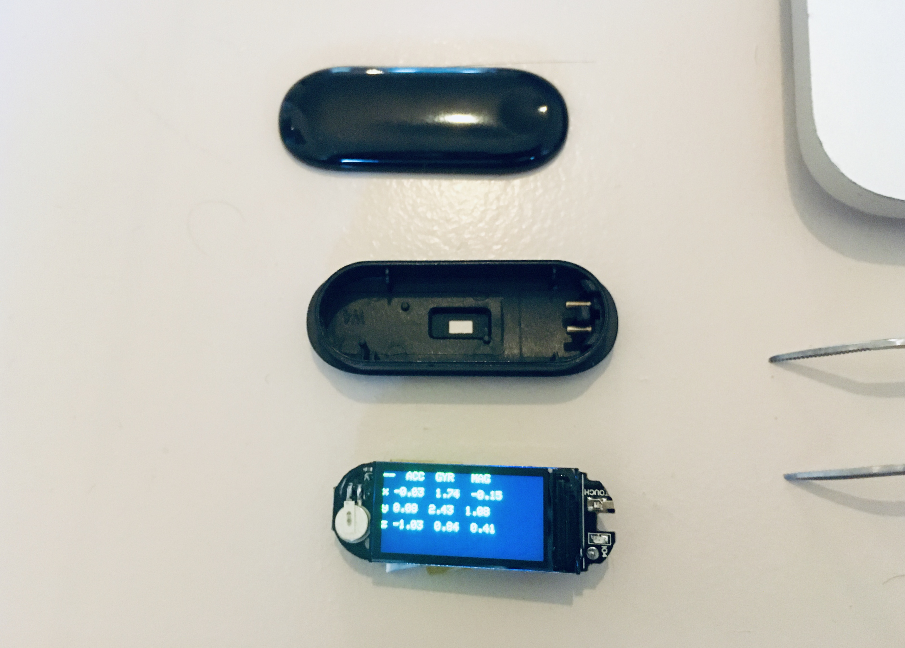

With a fine tweezer, you can lift out the board by sticking a leg under it in the tiny notch on the top right

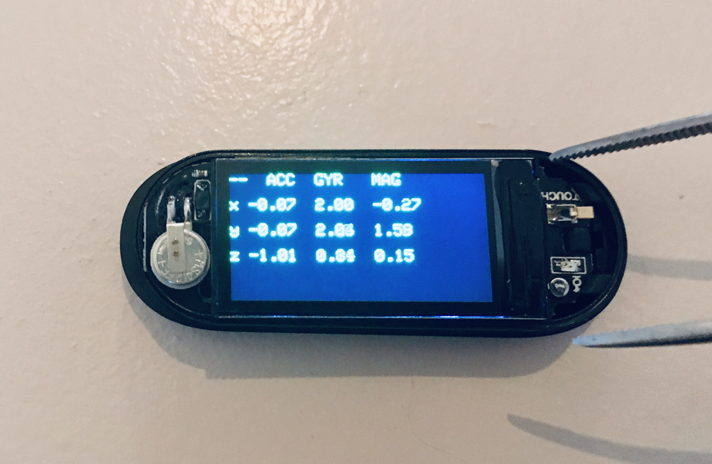

Connect the programmer cable to the board by opening the latch, sliding in the flexible ribbon wire, and closing the latch. Check the which port pops up in the Arduino IDE, and select the one that becomes active when you plug the cables into your USB port.

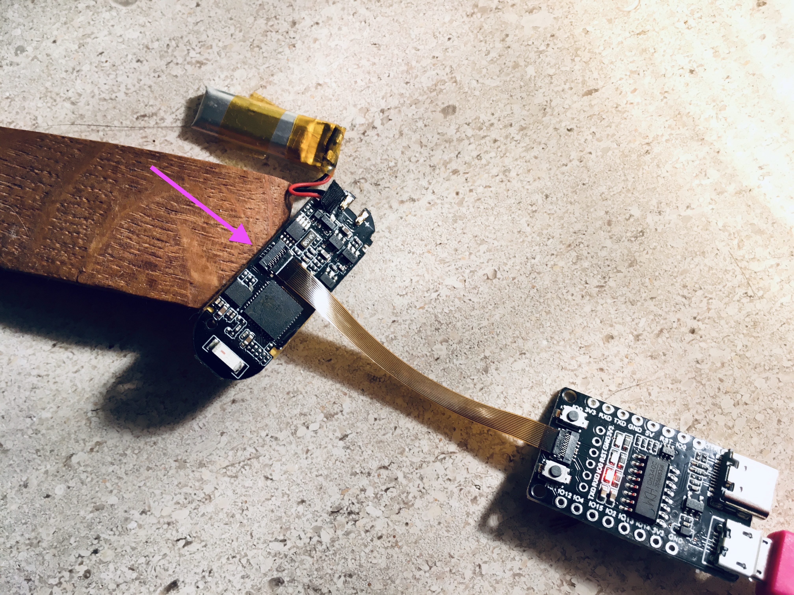

Watch this vid to see how https://www.youtube.com/watch?v=fNtdHYDsplc

**_NOTE_**: Look carefully how the device goes into the casing, if you put it upside down it will get stuck and you'll likely tear the cables loose to take it out.

### Upload an example sketch

Compile and try uploading one of the example sketches from this repository, and see if the screen is programmed correctly.  

**Problems uploading?**

1. Sometimes it may be necessary to hold down the 'boot' button on the programmer board when the console displays the text 'Connecting...'. 
2. If you are getting an error during uploading you may try to lower the upload speed, by going to the menu 'Tools' > 'Upload Speed'. 
   The default value is 921600, but 460800 seems to works more reliably.

**Simple examples**

- _helloworld_ : wakes up the screen when you press the button
- _blink_: turn the on-board LED on/off with the button
- _touchpad_led_: turn on LED with feedback in serial
- _animation_: displays text and a bouncing ball
- _invertcolors_: displays text in 4 colors, invert with button
- _fonts_: cycles through installed fonts in 6 sizes (plus a custom one)
- _simple_clock_: shows clock and date without extra fuss
- _ellipses_: draws random ellipses in random colors
- _sprite_: working with objects you can repeat relative to a point

**More advanced examples**

- _dot_ : Displays the accelerometer data and draws a little ball that can be balanced by moving the wristband.
- _Mac_address_colors_ : Scans for wifi devices nearby and displays the MAC addresses of those devices as a color gradient

### Upload via Wifi

Open the BasicOTA sketch and find line 6 and 7 where you are asked to put in your network's name and password:

    const char* ssid = "INSERT NETWORK NAME";
    const char* password = "INSERT PASSWORD";

Put in your details, and upload the sketch. Open the serial monitor. If all goes well, the IP address of the device will be displayed in the serial monitor.

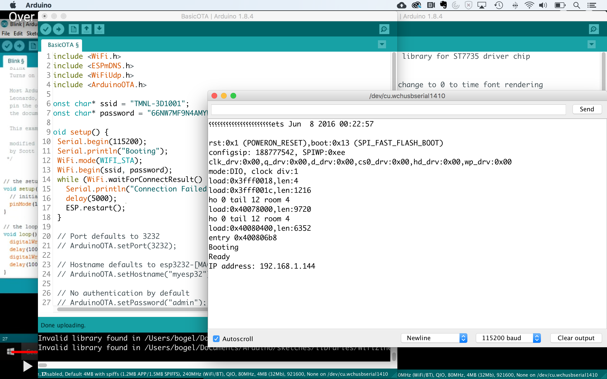

Close the sketch and open another example that uses the display. Then go to:

> Tools > Port > Network Ports

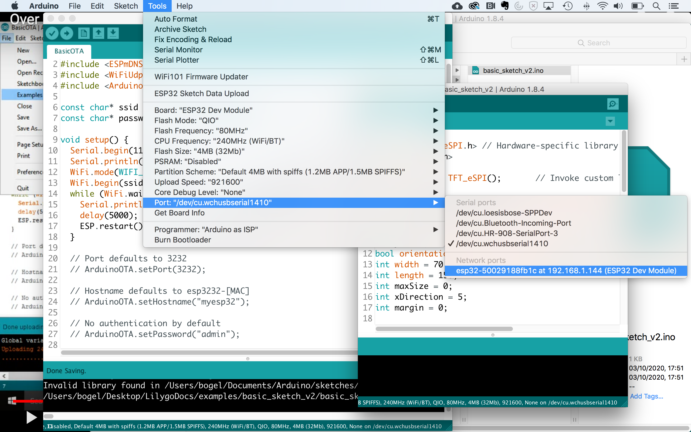

And you will see a new port listed there, e.g. _ESP32 XXXXX at 192.168.xxx.xxx_ Select that port and upload the sketch. It will now upload via the network instead of the serial. Handy if you prefer to keep the board in the casing, but will drain the battery since it's not charging at the same time.

Source: https://www.youtube.com/watch?v=GR2ZXyPaqMo

If you upload a new sketch, make sure it also supports OTA else this will work only once of course :)

## Options to explore

### On-board stuff to play with

| Name                    | Pin |
| ----------------------- | --- |
| Red LED                 | 4   |
| Display backlight       | 27  |
| Touchpad                | 33  |
| Touchpad Power (pullup) | 25  |

See also example sketches

### Orientation

You can set the orientation with increments of 90 degrees, where 0 = portrait, 1 = landscape and so on. The 0,0 point is on the top left.

      tft.setRotation(1);   	// where 0 = portrait, 1 = landscape

### Dimensions

- short edge = 80 pixels
- long edge = 160 pixels

### Images

To display an image you have to convert an image to a UTFT format required into special code that can be displayed.

First crop your image to a 160 x 80 px image.

Go to this website to upload and convert it:
http://www.rinkydinkelectronics.com/t_imageconverter565.php

then copy the code into the _image.h_ tab of your sketch. For an example, try the **Image** example

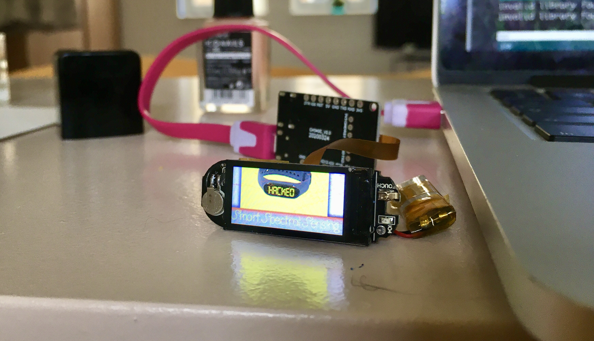_Display an image_

**Reduce brightness of the display**

put this in your setup :

      //   Reduce the brightness for longer battery life
       ledcSetup(0, 1000, 8);
       ledcAttachPin(TFT_BL, 0);
       ledcWrite(0, 10);

**Lower MCU frequency**

to reduce current consumption & heat:

    // Lower MCU frequency can effectively reduce current 	consumption and heat
    setCpuFrequencyMhz(80);

### Add custom fonts

You can add custom fonts to the TFT*eSPI library. To do that, locate the TFT_eSPI library and find the folder called \_Tools*. In there you will find a Processing sketch that allows you to transform a font into a byte arraw you can include in your sketch.

Run the Processing sketch by clicking the "play" button. It will list all the fonts on your system in a file called _System_Font_List.txt_ in the sketch folder.

Open that file and locate the font you want to use. Write down the array number. Put that number in line 124 of the .pde sketch, choose a font size and run it again. You should now see your chosen font appear in the Processing window.

**Note:** fonts imported like this are not scaleable, for each font size you have to go through this process.

A .vlw file of your font is generated. You can find it in the TFT_eSPI library folders:

> Mac HD > Users > YourName > Documents > Arduino > sketches > libraries > TFT_eSPI > Tools > Create_Smooth_Font > Create Font > FontFiles

**Convert the .vlw to a byte array**

Make a new .h tab inside your Arduino sketch and put this in the file:

    #include <pgmspace.h>

    const uint8_t  YourFontName[] PROGMEM = {

    //YOUR BYTE ARRAY HERE

    };

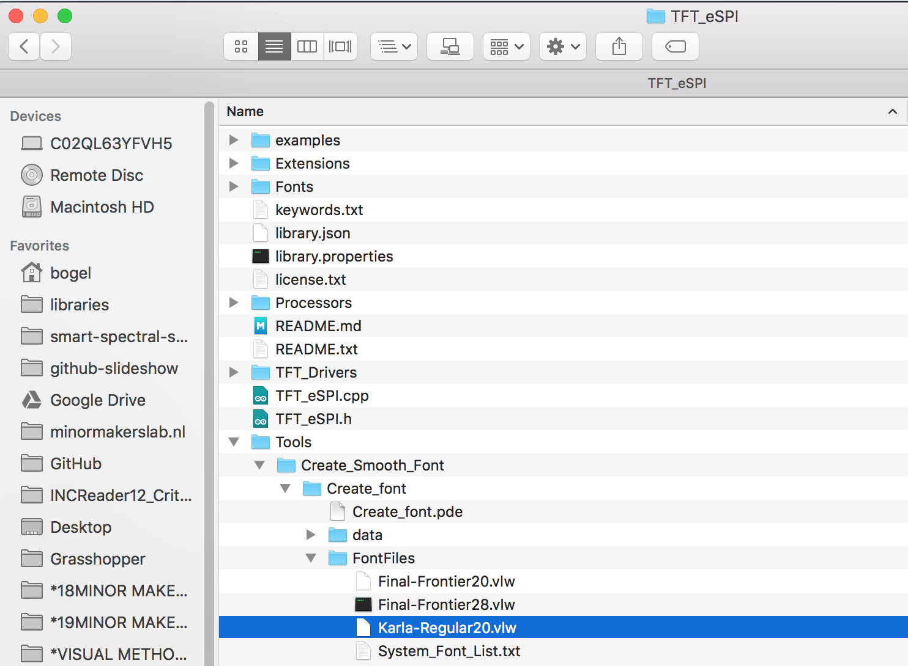_Find the vlw file inside the TFT_eSPI library_

Go to this webpage and upload your .vlw file: https://tomeko.net/online_tools/file_to_hex.php?lang=en and copy the output to your clipboard.

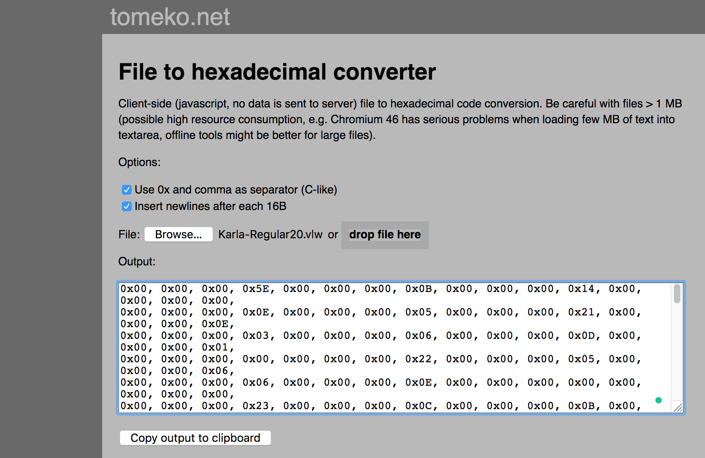

Then copy paste the byte array you just generated between the { }; brackets where it says //YOUR BYTE ARRAY HERE

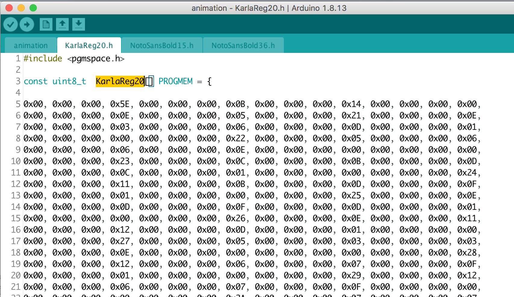_What it should looke like, that closing bracket and semicolong are all the way at the end_

**In the Arduino sketch**

Make sure there's an .h file with a byte array that defines the font. See also the _animation_ to see an example.

Define and include the fonts you want to use, e.g.

    	#include "KarlaReg20.h"           // == name of the .h file (tab)

as well as:

    	#define KARLA_20 KarlaReg20           // == name given inside .h tab (after "const uint8_t")

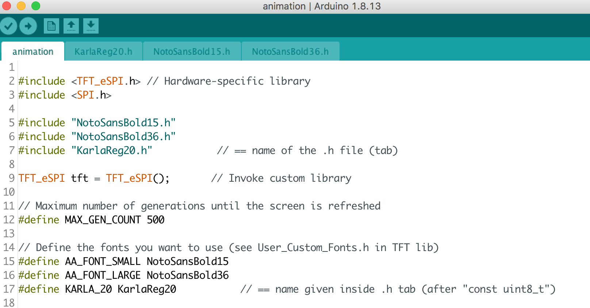_ define the font using the same name as the one in the .h file (see highlighted)_

(in the void loop) Load the font before you want to use it.

    	tft.loadFont(KARLA_20); // Load font you want to use

(in the void loop) Unload the font before the end of the loop.

    	tft.unloadFont(); // Remove the font to recover memory used

### Some supported commands

**Text alignment**

      tft.setTextDatum(TL_DATUM); // for Top Left datum

Other options to play with:

- TL_DATUM = Top left (default)
- TC_DATUM = Top centre
- TR_DATUM = Top right

- ML_DATUM = Middle left
- MC_DATUM = Middle centre
- MR_DATUM = Middle right

- BL_DATUM = Bottom left
- BC_DATUM = Bottom centre
- BR_DATUM = Bottom right

- L_BASELINE = Left character baseline (Line the 'A' character would sit on)
- C_BASELINE = Centre character baseline
- R_BASELINE = Right character baseline

**Set padding**

    	tft.setTextPadding(0); // Setting to zero switches off the padding

**Various**

- Print line to screen

      tft.println("print a sentence plus a newline");

- Draw a string (text, x, y, font)

        tft.drawString("text here", 0, 0, 2);

- Draw a character (character, x, y, size)

        tft.drawChar(127, 10, 10, 2);

- Set text wrap

      tft.setTextWrap(true); // Wrap on width
      tft.setTextWrap(true, true); // Wrap on width + height

- Change the font colour and the background colour

        tft.setTextColor(TFT_YELLOW, TFT_BLACK);

- Give background fill

        tft.fillScreen(TFT_BLACK);

- Draw a filled rectangle at specified coordinates

          tft.fillRect (50, 90, 60, 40, TFT_BLACK);

- Set text size

      tft.setTextSize(1);

### Color

You can define colors in the _TFT_eSPI.h_ file, which you can now find in the library folder. These are already specified:

- TFT_BLACK
- TFT_NAVY
- TFT_DARKGREEN
- TFT_DARKCYAN
- TFT_MAROON
- TFT_PURPLE
- TFT_OLIVE
- TFT_LIGHTGREY
- TFT_DARKGREY
- TFT_BLUE
- TFT_GREEN
- TFT_CYAN
- TFT_RED
- TFT_MAGENTA
- TFT_YELLOW
- TFT_WHITE
- TFT_ORANGE
- TFT_GREENYELLOW
- TFT_PINK
- TFT_BROWN
- TFT_GOLD
- TFT_SILVER
- TFT_SKYBLUE
- TFT_VIOLET

Colors are stored as uint_32_t, so can create your own. 
Keep in mind that the color use RGB565 values, you can find an excellent explanation here: http://www.barth-dev.de/online/rgb565-color-picker/

**PIN connections**

| Name                    | Pin    |
| ----------------------- | ------ |
| Red LED                 | 4      |
| Display backlight       | 27     |
| Touchpad                | 33     |
| Touchpad Power (pullup) | 25     |
| RTC Interrupt           | 34     |
| Battery ADC             | 35     |
| I2C_SDA                 | 21     |
| I2C_SCL                 | 22     |
| CHARGE Indication       | 32     |
| IMU INT1 sensor         | 38     |
| IMU INT2 sensor         | 39     |
| IMU INTM sensor         | 37     |
| IMU RDY sensor          | 36     |
| TFT Driver              | ST7735 |
| TFT_MISO                | N/A    |
| TFT_MOSI                | 19     |
| TFT_SCLK                | 18     |
| TFT_CS                  | 5      |
| TFT_DC                  | 23     |
| TFT_RST                 | 26     |

##To Find Out

### List devices/networks

### Send each other coordinates?

### Let a sprite/image move with sensordata

### Wearable wifi zine

### upload jpgs with SPIFFS
